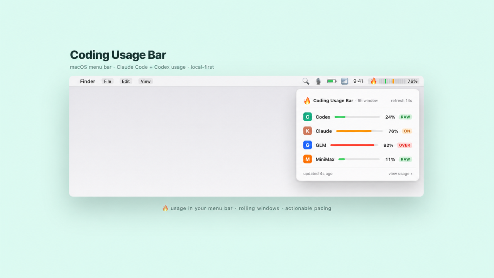
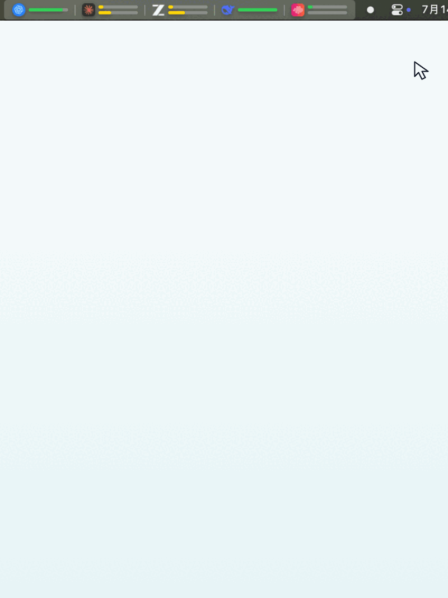

# Coding Usage Bar

[English](README.md) · [简体中文](README.zh-CN.md)

**Claude Code and Codex usage monitoring in your macOS menu bar.** Track rolling plan limits across Claude Code, OpenAI Codex, GLM (Zhipu AI), DeepSeek, MiniMax, and Kimi (Moonshot AI) before a coding session hits the wall.

[](https://www.npmjs.com/package/coding-usage-bar)
[](https://github.com/hanzhangzzz/coding-usage-bar/actions/workflows/test.yml)
[](LICENSE)
[](#requirements)



Coding Usage Bar does more than display quota percentages. It compares short rolling windows with the weekly budget and labels your pace as learning, under-burning, on track, over-burning, or close to a limit.

Claude Code and Codex data stays local and is read from files those tools already produce. Provider API keys for GLM, DeepSeek, and MiniMax are stored only in `~/.coding-usage-bar/config.json` and sent directly to their respective quota APIs. Kimi reads its key from `~/.coding-usage-bar/config.json` or, when unset, from the kimi.com lane in `~/.config/claude-lanes/config.env`.

## Live SwiftBar Menu

The screenshot is captured from the live SwiftBar plugin. The animation reproduces opening and closing that menu without altering the captured usage data.

<p align="center">
  
</p>

## Quick Start

```bash
npx coding-usage-bar install
coding-usage-bar doctor
coding-usage-bar status
```

`install` creates a local runtime at `~/.coding-usage-bar/app`, a user-level CLI shim at `~/.local/bin/coding-usage-bar`, a launchd agent, a default config file, and a SwiftBar menu bar plugin. Make sure `~/.local/bin` is in your `PATH`.

## Commands

| Command | Purpose |
|---------|---------|
| `coding-usage-bar install` | Install runtime, launchd checker, SwiftBar host/plugin, and Claude ingest when safe |
| `coding-usage-bar uninstall` | Remove Coding Usage Bar managed launchd/status line/plugin config |
| `coding-usage-bar doctor` | Check local Codex/Claude/GLM usage sources and notification backend |
| `coding-usage-bar status` | Print the rolling windows reported by each account and their pacing state from `~/.coding-usage-bar/status.json` |
| `coding-usage-bar status --json` | Print the same status snapshot written to `~/.coding-usage-bar/status.json` |
| `coding-usage-bar status --refresh` | Re-collect local usage before printing status |
| `coding-usage-bar menubar render` | Print SwiftBar-compatible menu text from `~/.coding-usage-bar/status.json` |
| `coding-usage-bar menubar install` | Install the SwiftBar plugin wrapper |
| `coding-usage-bar menubar uninstall` | Remove the Coding Usage Bar managed SwiftBar plugin |
| `coding-usage-bar ingest claude-statusline` | Read Claude Code status line JSON from stdin and cache usage |

## Install Behavior

`coding-usage-bar install` is designed to be repeatable.

- From `npx coding-usage-bar install` or `npx --no-install coding-usage-bar install`, it copies the current package into `~/.coding-usage-bar/app` through a temporary directory, then restarts launchd.
- From a source checkout, `npm run build && npx --no-install coding-usage-bar install` installs the current local build.
- From the installed shim `coding-usage-bar install`, it detects that it is already running from `~/.coding-usage-bar/app`, skips runtime self-copy, and still refreshes the CLI shim, SwiftBar plugin, and launchd agent.
- The launchd job runs `~/.coding-usage-bar/app/dist/cli.js daemon --once` every 300 seconds.
- The installer does not overwrite user-managed Claude Code status line scripts. If one already exists, it asks before installing a Coding Usage Bar wrapper around it.
- Long-lived launchd, SwiftBar, and Claude wrapper commands prefer the stable `node` found in `PATH` (for example `/opt/homebrew/bin/node`) instead of a versioned Homebrew Cellar path. Set `CODING_USAGE_BAR_NODE=/absolute/path/to/node` before installing to override it, and rerun `coding-usage-bar install` after moving or replacing Node.

## Claude Code Status Line

If you do not have a Claude Code status line, `coding-usage-bar install` can create a minimal one.

If you already have one, Coding Usage Bar will ask before changing Claude settings. When you answer `y`, it writes a Coding Usage Bar wrapper at `~/.coding-usage-bar/claude/statusline.sh`, saves the original command metadata, and updates `statusLine.command` so the wrapper runs first. The wrapper ingests Claude usage, then forwards the same input to your existing status line command. `coding-usage-bar uninstall` restores the original command.

If you answer `n` or run in a non-interactive shell, Coding Usage Bar skips the status line update and prints manual setup instructions. Add this near the top of your own script:

```bash
input="$(cat)"
printf "%s" "$input" | node "$HOME/.coding-usage-bar/app/dist/cli.js" ingest claude-statusline >/dev/null

# Make the rest of your script read from "$input" instead of stdin.
```

Without this integration, Claude usage stays unavailable in Coding Usage Bar. Claude burn-rate analysis, Claude notifications, and Claude menu bar data will report `CLAUDE_INGEST_MISSING`; Codex usage is unaffected.

## Codex

Coding Usage Bar reads Codex `payload.rate_limits` from local `~/.codex` JSONL session data. It displays the windows the current account actually reports; some accounts expose both 5h and 7d windows, while others currently expose only 7d. If no rate-limit data exists, run Codex CLI or Codex App once and complete a normal interaction.

## GLM (Zhipu AI)

Coding Usage Bar calls the Zhipu AI quota API (`GET /api/monitor/usage/quota/limit`) to read 5h and 7d usage windows. You need to set `glm.apiKey` in `~/.coding-usage-bar/config.json`:

```json
{
  "providers": ["codex", "claude", "glm"],
  "glm": {
    "baseUrl": "https://open.bigmodel.cn",
    "apiKey": "your-api-key"
  }
}
```

Get your API key from the [Zhipu AI console](https://open.bigmodel.cn). Without this key, GLM monitoring will report `GLM_API_KEY_MISSING`.

## DeepSeek

Coding Usage Bar calls `GET https://api.deepseek.com/user/balance` to read your account balance. DeepSeek exposes balance rather than 5h/7d usage windows, so the menu bar shows `Available` or `Depleted` plus the currency amount. Set `deepseek.apiKey` in `~/.coding-usage-bar/config.json`:

```json
{
  "providers": ["codex", "claude", "glm", "deepseek"],
  "deepseek": {
    "apiKey": "your-deepseek-api-key"
  }
}
```

Without this key, DeepSeek monitoring will report `DEEPSEEK_API_KEY_MISSING`.

## MiniMax (M3)

Coding Usage Bar calls `GET https://api.minimaxi.com/v1/token_plan/remains` to read 5h and 7d usage windows. MiniMax returns two signals per model: a count-based ratio (`current_*_usage_count` / `current_*_total_count`) for tiered models like `video`, and a credit-based `current_*_remaining_percent` (0-100) for the `general` model where the count stays at 0. Coding Usage Bar prefers the count ratio when total > 0 and otherwise derives used% as `100 - remaining_percent`. Set `minimax.apiKey` and (optionally) `minimax.region` in `~/.coding-usage-bar/config.json`:

```json
{
  "providers": ["codex", "claude", "glm", "minimax"],
  "minimax": {
    "region": "cn",
    "apiKey": "your-minimax-api-key"
  }
}
```

`region` defaults to `cn` (api.minimaxi.com); set it to `global` to use api.minimax.io. Without this key, MiniMax monitoring will report `MINIMAX_API_KEY_MISSING`.

## Kimi (Moonshot AI)

Coding Usage Bar calls `GET https://api.kimi.com/coding/v1/usages` to read 5h and 7d usage windows. The response carries the 300-minute rolling window in `limits[]` and the weekly window in the top-level `usage`, with `limit`/`used`/`remaining` as strings; Coding Usage Bar derives used% from `used / limit` (or from `used / (used + remaining)` when limit is 0). Set `kimi.apiKey` in `~/.coding-usage-bar/config.json`:

```json
{
  "providers": ["codex", "claude", "glm", "minimax", "kimi"],
  "kimi": {
    "apiKey": "your-kimi-api-key"
  }
}
```

If `kimi.apiKey` is empty, Coding Usage Bar falls back to the lane whose `CONFIG_<n>_BASE_URL` points at kimi.com in `~/.config/claude-lanes/config.env` and uses that lane's `CONFIG_<n>_AUTH_TOKEN` (and base URL). Without either source, Kimi monitoring will report `KIMI_API_KEY_MISSING`.

## Profiles

Set `CODING_USAGE_BAR_PROFILE=high` for the more aggressive profile. The default is `low`.

```bash
CODING_USAGE_BAR_PROFILE=high coding-usage-bar status
```

Both profiles are constrained by the weekly budget. When a short window is reported, Coding Usage Bar does not treat filling every short window as the goal.

## Provider Config

`coding-usage-bar install` creates `~/.coding-usage-bar/config.json`:

```json
{
  "providers": ["codex", "claude", "glm", "deepseek", "minimax", "kimi"]
}
```

Remove a provider from this list if you do not want Coding Usage Bar to monitor it. For one-off runs, `CODING_USAGE_BAR_PROVIDERS=codex coding-usage-bar status --refresh` also works.

## Menu Bar

The first menu bar implementation uses SwiftBar as a thin host. Coding Usage Bar still owns collection and state; the SwiftBar plugin only runs `coding-usage-bar menubar render` and reads `~/.coding-usage-bar/status.json`.

`coding-usage-bar install` checks for SwiftBar and installs it with Homebrew cask when it is missing. It installs the Coding Usage Bar plugin into SwiftBar's configured `PluginDirectory`, not blindly into a hardcoded default directory, then opens SwiftBar.

```bash
coding-usage-bar menubar install
```

If SwiftBar is not installed, `coding-usage-bar doctor` will report it. If SwiftBar already has a custom plugin folder, Coding Usage Bar uses that folder.

The compact menu bar title and dropdown use recognizable Provider marks for Codex, Claude Code, Zhipu AI, DeepSeek, MiniMax, and Kimi alongside the rolling-window data (DeepSeek shows balance instead of windows):

```text
{Codex icon} 5H:14%,7D:67% │ {Claude icon} 5H:24%,7D:74% │ {GLM icon} 5H:36%,7D:7%
```

SwiftBar only supports one bitmap image on a single stable title item, so Coding Usage Bar renders the full title into one transparent PNG at render time. That bitmap keeps each provider marker next to its own usage segment while avoiding SwiftBar's multi-title rotation behavior. The dropdown stays read-only and uses SwiftBar-native symbols, badges, progress meters, reset time, target range, data age, and warnings. SwiftBar is a host dependency; `coding-usage-bar uninstall` removes the Coding Usage Bar plugin but does not uninstall SwiftBar itself.

## Runtime Files

| Path | Purpose |
|------|---------|
| `~/.coding-usage-bar/app/` | Stable runtime copy used by launchd, Claude ingest hints, and SwiftBar |
| `~/.coding-usage-bar/config.json` | Provider selection, default `["codex", "claude", "glm", "deepseek", "minimax", "kimi"]` |
| `~/.coding-usage-bar/status.json` | Stable display-layer entry point |
| `~/.coding-usage-bar/codex/latest.json` | Latest normalized Codex usage |
| `~/.coding-usage-bar/claude/latest.json` | Latest normalized Claude usage after status line ingest |
| `~/.coding-usage-bar/glm/latest.json` | Latest normalized GLM usage from Zhipu AI quota API |
| `~/.coding-usage-bar/deepseek/latest.json` | Latest normalized DeepSeek balance from DeepSeek API |
| `~/.coding-usage-bar/minimax/latest.json` | Latest normalized MiniMax 5h/7d usage from MiniMax API |
| `~/.coding-usage-bar/kimi/latest.json` | Latest normalized Kimi 5h/7d usage from Kimi usages API |
| `~/.local/bin/coding-usage-bar` | CLI shim pointing at the stable runtime |
| `~/Library/LaunchAgents/com.duying.coding-usage-bar.plist` | macOS launchd agent |
| SwiftBar `PluginDirectory` / `coding-usage-bar.1m.js` | Menu bar plugin wrapper |

## Notifications

On macOS, Coding Usage Bar uses `terminal-notifier` when available and attaches a dynamic data card as the notification content image.

The card shows provider, the available rolling-window usage, state label, target range, and reset countdown. This avoids asking users to infer meaning from a red/yellow icon.

After an interactive install, Coding Usage Bar may ask whether you want to star the repository. The prompt defaults to **No** (`[y/N]`) and only uses an already authenticated GitHub CLI after explicit `y`/`yes` consent.

If `terminal-notifier` is unavailable, Coding Usage Bar falls back to `osascript display notification`, which uses the system default notification appearance.

See the [product and technical baseline](https://github.com/hanzhangzzz/coding-usage-bar/blob/main/plan.md) for the current design.

## Why Coding Usage Bar?

- **One menu bar for multiple coding providers:** Claude Code, Codex, GLM, DeepSeek, MiniMax, and Kimi.
- **Pacing, not just percentages:** short-window usage is evaluated against the weekly budget.
- **Local-first:** Claude Code and Codex usage is read from local tool output, without a separate account or telemetry service.
- **Visible but lightweight:** SwiftBar is only the host; collection and display state remain separated and auditable.
- **Actionable warnings:** limit risk and burn-rate notifications include reset timing and current usage.

## Requirements

- macOS
- Node.js 20 or newer
- SwiftBar (the installer can install it through Homebrew)
- Claude Code or Codex for local usage monitoring

## Development

```bash
npm ci
npm test
npm run build
npm pack
```

## License

[MIT](LICENSE)

Provider names and trademarks belong to their respective owners. Coding Usage Bar is an independent project and is not affiliated with or endorsed by Anthropic, OpenAI, Zhipu AI, DeepSeek, MiniMax, or Moonshot AI. Provider marks are used only for identification, are excluded from the MIT License, and are documented in [THIRD_PARTY_NOTICES.md](THIRD_PARTY_NOTICES.md).
